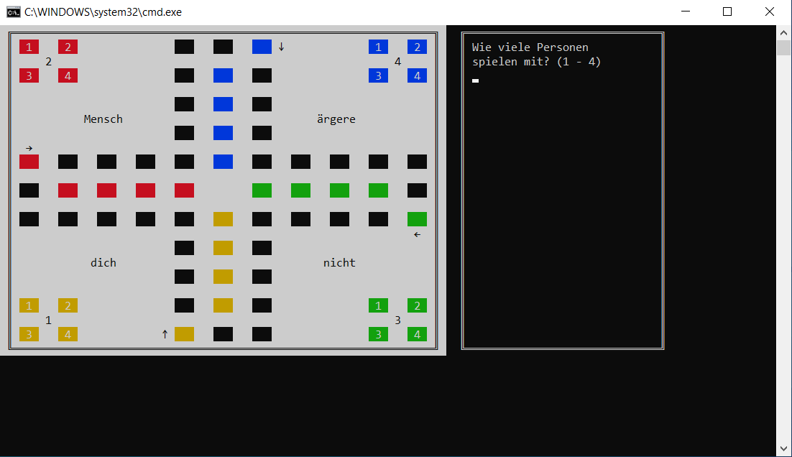
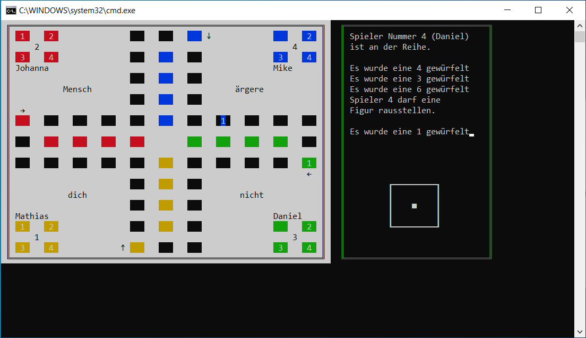
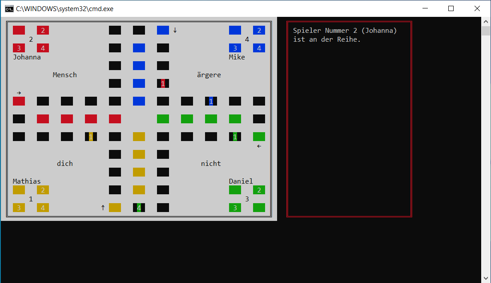

# Mensch ärgere dich nicht als Konsolenspiel

Die **Mensch ärgere dich nicht App** wurde in einem vier tägigen Projekt entwickelt, um meine Fähigkeiten in Python 3.10 zu demonstrieren.

## Installation 🔌
Folgen Sie diesen Schritten, um die App in Visual Studio Code zu installieren:

1. Laden Sie die Repository-Daten herunter, indem Sie den folgenden Befehl ausführen:
   ```shell
   git clone https://github.com/mikework24/madn.git
   ```

2. Führen Sie die Datei 'game.bat' aus.

## Screenshots
  

## Projektstruktur

Das Projekt wurde gemäß den Prinzipien von „Clean Code“ und „PEP 20“ entwickelt und zeichnet sich durch eine klare und einfache Struktur aus.

### madn_screen.py
In der Datei "madn_screen.py" finden Sie alle notwendigen Funktionen, um das Spiel in der Konsole darzustellen. Hierzu gehören Funktionen zum Löschen des Konsolenbildschirms, zum gezielten Überschreiben von Text auf der Konsole und zum Zeichnen von Rechtecken in verschiedenen Farben. Diese Funktionen erleichtern die Ausgabe der Spiellogik und sorgen für eine übersichtliche Darstellung. Zudem gibt es Funktionen zur Darstellung des Spielbretts und der Spielfelder für die Spielfiguren.

### madn_func.py
Die Datei "madn_func.py" importiert das Modul "random" zur Generierung von Zufallszahlen und das Modul "madn_screen.py" für die Ausgabe in der Konsole. Sie befasst sich mit den Spielprozessen und Benutzereingaben. Benutzereingaben sind so gestaltet, dass falsche Eingaben erkannt und korrigiert werden können. Für jeden Zug eines Spielers werden mögliche gültige Züge ermittelt und dem Spieler zur Auswahl angeboten. Das Spiel verwendet ein Punktesystem, nach dem der Computer-Spieler die bestmöglichen Züge auswählt, um das Spiel zu gewinnen.

### run_game.py
Die Datei "run_game.py" importiert "madn_func.py" und enthält die "Game"-Klasse, in der Spieler und Spielfiguren registriert sind. Diese Klasse verfügt über drei Methoden:
   - "draw_game" zum initialen Zeichnen des Spiels.
   - "setup_players" zur Anmeldung der Spieler.
   - "start_game" zur Initialisierung des Spiels.
Die Methode "start_game" ruft die beiden anderen Methoden auf und ermöglicht das Starten des Spiels mit einem einzigen Aufruf. Das Spiel durchläuft eine Runde, in der die Spieler nacheinander an der Reihe sind, und wird unterbrochen, sobald ein Gewinner feststeht. Anschließend wird die "Game"-Klasse erneut aufgerufen, um ein neues Spiel zu starten.